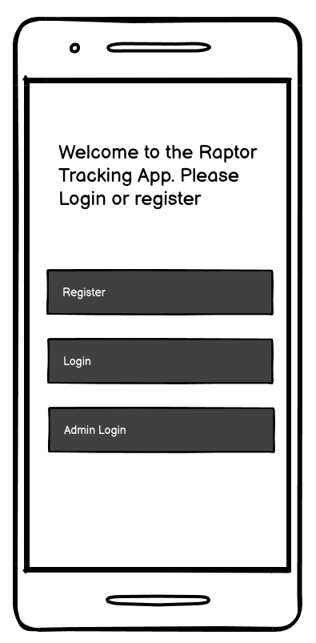
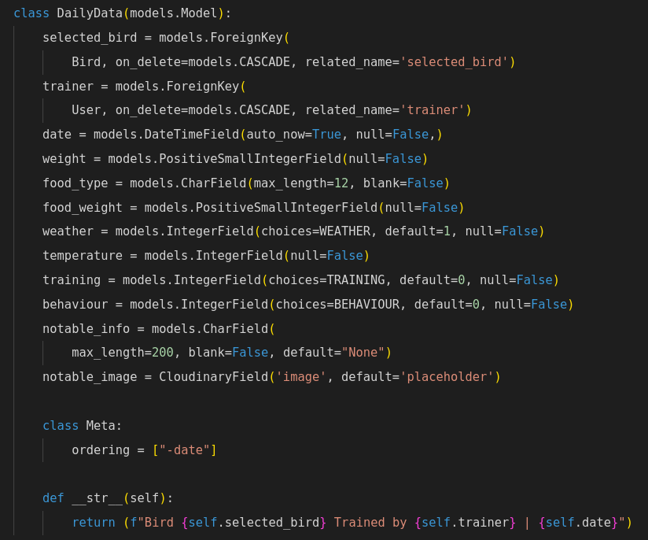
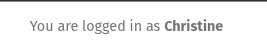

# Raptor Health Tracker

The Raptor Health Tracker is a web app designed to aid Falconers, Trainers and Rehabilitation specialists 
who work with birds of prey.
Raptors, Crows and Vultures require strict tracking of their food intake, 
their weight and exercise routines.
With the ability to upload photos and track numerous other data, 
The Raptor Health Tracker is here to help to keep the data coherent. 

## Live Site
https://raptor-health-tracker-670ca7ff3a4d.herokuapp.com/

## Repository
https://github.com/Drekkg/Raptor_Health_Tracker.git

## Author
Derek Garnett

# Table of contents
- [Raptor Health Tracker](#raptor-health-tracker)
  - [Live Site](#live-site)
  - [Repository](#repository)
  - [Author](#author)
- [Table of Contents](#table-of-contents)
- [UX](#ux)
  - [Target Audience](#target-audience)
  - [Design Choices](#design-choices)
  - [Wireframes](#wireframes)
- [Information Architecture](#information-architecture)
  - [Entity Relationship Diagram](#entity-relationship-diagram)
  - [Database Choice](#database-choice)
- [Data Models](#data-models)
  - [The Models](###Breakdown-of-the-Models)
  - [Comments](#comments)
  - [Profile](#profile)
- [Agile Process](#agile-process)
  - [Project Goals](#project-goals)
  - [Initial User Stories](#initial-user-stories)
  - [Scope](#scope)
- [Features](#features)
  - [Implemented Features](#implemented-features)
  - [Future Features](#future-features)
- [Testing](#testing)
  - [Manual Testing](#manual-testing)
  - [Defensive programming testing](#defensive-programming-testing)
  - [Compatibility and Responsive Testing](#compatibility-and-responsive-testing)
  - [Accessibility Testing](#accessibility-testing)
  - [Validation Testing](#validation-testing)
- [Defects](#defects)
  - [Defects of Note](#defects-of-note)
  - [Outstanding Defects](#outstanding-defects)
- [Technologies Used](#technologies-used)
  - [Languages](#languages)
  - [Frameworks, Libraries & Programs Used](#frameworks-libraries--programs-used)
- [Deployment](#deployment)
  - [Fork and Clone the Repository](#fork-and-clone-the-repository)
  - [Development Deployment](#development-deployment)
  - [Production Deployment](#production-deployment)
- [Credits](#credits)
  - [Media](#media)
  - [Acknowledgments](#acknowledgments)

# UX
## Target Audience
People who work with birds are well aware of how sensitive they are. Small problems can escalate really quickly.
Having the data on hand, on-line and easy to read helps make informed decisions.
Birds in breeding programs and rehabilitation centers need constant observation and tracking of various metrics:
- The bird's weight - it is crucial to notice any fluctuation in weight, especially a decrease. Measurements are taken daily, sometimes twice or more.
- Food intake - relative to weight the bird needs sufficient nourishment.
- Excercise - for their psychological well being, birds needs sufficient free flight and other stimulating activities.
The Raptor Health Tracker is here to digitalise the tracking process. Paper forms can be lost or become unreadable - birds of prey have sharp beaks and talons and enjoy shredding(and pooping on) unattended folders.
Also the ability for interested parties - vets, specialists etc, to remotely track the birds online.

## Design Choices
### Colors

The colour palette is from coolors.co
Lots of blue in different shades to evoke empty skies. Who doesn't want to be a bird - at least sometimes.
Natural greens to fit the conservation theme.

### Typography
I chose a basic font for readability.
- Roboto
- Lato 
From google
### Frameworks, plugins, tools used
- Bootstrap
- Django
- req.txt:
 -- asgiref==3.8.1
 -- cloudinary==1.36.0
 -- crispy-bootstrap5==0.7
 -- dj-database-url==0.5.0
 -- dj3-cloudinary-storage==0.0.6
 -- Django==4.2.14
 -- django-allauth==0.57.2
 -- django-crispy-forms==2.3
 -- gunicorn==20.1.0
 -- oauthlib==3.2.2
 -- psycopg2==2.9.9
 -- PyJWT==2.9.0
 -- python3-openid==3.2.0
 -- requests-oauthlib==2.0.0
 -- sqlparse==0.5.1
 -- urllib3==1.26.19
 -- whitenoise==5.3.0

## Wireframes
Landing - Login page:

Bird List Page:

 Bird detail page:

Back to bird list button - 
Edit Bird Button - 
Delete Bird Button

Add bird daily data form

Daily data accordion displaying essential data

# Information Architecture
## Entity Relationship Diagram

## Database Choice
- postgres relational database 
- heroku servers
- Cloudinary
# Data Models
- Users can add daily data
- Users can also register and start adding data. In production users would have to be vetoed by an admin to prohibit malicous or incompetent 
users adding data, but in lieu of this project I gave users the ability to create data.
- Logged in Admin can add birds, delete birds, delete bird daily data and edit bird data. 

## Bird Daily Data
The bird daily data view/page is the main feature of the app. Users can quickly scan and check the selected bird's weight. Clicking on the accordion will reveal all daily bird data. The user can also effortlessly add daily data.
### CRUD
- **Create:** Registered users can add daily data
- **Read:** Logged in users can read all entered data.
- **Update:** Only Administrators/super-users can edit data. 
- **Delete:** Only Administrators/super-users can delete data. 

## Breakdown of the Models
The various imports on which the models rely

### The Bird model

Custom models:
### All custom models use form validation- either max_length of string; unique entry(where appropriate); null entry not allowed.
### The cloudinary entry uses validation to check if the data being uploaded is a valid image. This occurs in the appropiate view.

### The Daily Data model

### All custom models use form validation- either max_length of string; max integer input; unique entry(where appropriate); null entry not allowed.
### The cloudinary entry uses validation to check if the data being uploaded is a valid image. This occurs in the appropiate view.

# Agile Process
## Project Goals
- Users can add and read bird daily data
- Admin can edit and delete bird data
- Admin can from the Admin dashboard edit and delete users; edit and delete birds; edit and delete daily data.
 
## Initial User Stories
[GitHub Project] (https://github.com/users/Drekkg/projects/6/views/1)

I used the MOSCOW principal to help me decide what features to include and which features to add in a futere iteration.\
I first got a minimal viable product and then added extra features.\
A few features on the todo list will be added in futere iterations.

### specifications changed during development
Example: Changed the ability to add birds to the table from normal User to Admin

## Scope
The initial plan for the app was increasingly made more complex as desirable features were added.\
During development a lot of features had to be recalled.\
All features were added to future features.\
The app successfully manages to make all entered data available for review.\
Out in the field, users can add the required data on mobile devices(Tablets and phones)\
Admins and users can view and track the data from HQ
Admins can edit the data where errors have ocurred\
Admins can delete bird data\
Admins can add new bird data
# Features
## Implemented Features
## Landing Page 

- New unauthenticted users can view the landing Page.
- Defensive programming has been used to protect tampering pages without authentication
- Users can register an account
- Usernames and email addresses must be unique
- An already registered user can login 
- A superuser account has been created (admin)
- Superuser can login using the Admin Login button and is taken to the Admin dashboard
### Admin Dashboard

- The Admin Dashboard supplied by Django.
- The Admin can edit and delete all data
### Register Page

- An unregistered user can register on the site 
- Choosing a username, entering email address and creating a password
- In production, out in the wild, a new user would have to be vetoed by an administrator-\
  but for the purposes of this project I have allowed new users onto the site.   
## User Login

- A registered user can login by entereing their username and password.
- A cancel button takes the user back to the landing page.
## Bird List Page

- Once a user is logged in they are taken to the Bird List page.
- Here all birds in the table are displayed using photos and the bird name and type.
- When no photo is available, a default image is displayed  

- Users can click on the bird name and be taken to the bird detail page
### Navbar

- The Navbar is sticky and availible on pages where the user has logged in.

 
- The users name is displayed with a message informing them that they are logged in.

 
- After clicking on the Hamburger icon

- the navbar opens giving them the option to logout
- After clicking the button the user is taken to the logout page

- Here the user can logout and be taken back to the landing page.
- or click the cancel button and go back to the bird list 

## Bird Detail Page 

- The bird detail page is opened after the user clicks on a bird name in the bird list
- This is the main page where users can view the daily entered data.
![image] (assets/bird_detail_left.png)
- the bird photo is displayed once again to help avoid confusion
- The bird data is displayed

- A button to take the user back to the bird list.

- A button to display the daily data form.
- Once clicked the user is taken to the add daily data form where they can enter the required data

## Daily Data List
 
 - Below the button a list of all entered daily data is displayed 
 - An accordion component in a closed conditiion.
 - The dates of entered data is displayed as well the trainer
 - The bird weight is prominently displayed. 
 - The user can quickly scan all daily weight data and spot discrepancies.
 - Clicking on the element will open it displaying more daily data and also if uploaded an image.
 
 - Clicking on another element will close the open element

 ## Add Daily Data Form

- The add daily data form 
- The user can enter the following data:
- Weight: The weight of the bird in grams
- Food Type: The type of food(mouse, chicken etc)
- Food weight: The weight of the food 
- Weather: the weather conditions(dropdown menu)
- Training: The type of training undertaken(dropdown menu)
- Behaviour: The modd of the bird on the day(dropdown menu)
- Notable info: Any extra information
- Add an image: The user can upload an image from their device or on mobile take a photo and upload it directly.

- After clicking the submit button a modal appears asking the user to double check the entered data.

- The Add Data Modal 
-clicking the cancel button takes the user back to the form
- Clicking enter submits the form
- The entered data is displayed on the bird detail page in the daily data accordion element.

## Administrator Site
### There are a few differences when the admin is logged in.

- The message in the Navbar displays that you are logged in as an Admin

- The open Navbar displays links to:
- The Admin Dashboard
- The Add New Bird Form
- The Add New Bird  Icon is orange to draw the users attention to it.
- It is hidden in the navbar because Admins will rarely need to add new birds.

- On the Bird Detail there are extra buttons
- A button to delete the bird from the table 
- A button to edit the bird data.

- After clicking the delete button a delete bird modal is displayed.
- The Admin is asked to affirm that they  want to delete the selected bird from the table.
- Clicking Cancel takes the Admin back to the bird detail page.
- Clicking Delete permanently removes the bird data from the table.

- Clicking the edit bird button takes the Admin to the edit bird form
- Here all Bird data can be edited.
- Clicking the Save Changes button  updates the table for the selected bird.

## Future Features
- team apply button and form. Currently, users can apply to join a team by comments, in the future I am planning to create an application form for this
- search filter on top of the page to display particular game or skill level
- Team Ad owners will be able to accept od reject a joing team application
- more games and templates (as different games have different options, positions, etc.)
- upgrade profile page so users can ad a description, skill level, favourite games, and comment counter

# Testing
## Manual Testing

## Defensive programming testing

In the video below, I would like to present some defensive programming implemented in my project:

[Screenshare - 2023-06-02 1 19 36 PM.webm](https://github.com/PPindel/esports-teammates/assets/114284732/bb3aff5e-ad97-4125-8efb-83d34de00b19)

## Compatibility and Responsive Testing

Iphone 12, Safari:

Iphone 14 Pro, Safari:

Ipad 11 Pro, Safari:

Samsung Galaxy S21, Chrome:

Google Pixel 7, Chrome:

Desktop, Windows 11, Chrome:

Source: https://live.browserstack.com

As the most popular browsers in Europe are Chrome and Safari, I deceided to focus on these 2 browsers.

Source: https://gs.statcounter.com/browser-market-share/all/europe

## Accessibility Testing
Accessibility features has been implemented to Esports Teammates.
Aria labels and descriptions are added.
The site is optimized for desktop and mobile devices, please see below the Lighthouse audits:

Desktop landing page:

Mobile landing page:

Desktop main page:

Mobile main page:

Desktop team detail page:

Mobile team detail page:

### Keyboard Navigation
Esports Teammates is optimized for keyboard navigation!

## Validation Testing
### CSS Validation
The [Jigsaw validator](https://jigsaw.w3.org/css-validator/) was used to validate CSS.
No errors were found.

### HTML Validation
The **[W3 HTML Validator](https://validator.w3.org/)** was used to validate HTML by coping the page source as a direct input.
No errors were found.

Landing page:

Signup page:

Login page:

Home page:

Team Detail page:

Add Team Ad page:

Sign out page:

Edit Team Ad page:

Delete Team Ad page:

Edit comment page:

404 error page:

### JavaScript Validation
The **[Jshint validator](https://jshint.com)** was used to validate the JS function.
No errors were found.

### Python Validation
**[CI's pep8 tool](https://pep8ci.herokuapp.com/)** was used to validate each .py file created.
No errors were found.

In Blog folder:
admin.py:

apps.py:

forms.py:

models.py:

urls.py:

views.py:

In teamfinder folder:
asgi.py:

settings.py:

urls.py:

util.py:

wsgi.py:

In main folder:
manage.py:

# Defects
- my first defect was revealing the secret code to the github. Currently, the secred code is changed and protected, and the project is safe (occured on 14th of March, fixed on 14th of March)
- author tag was not displaying correctly (occured on 29th of March, fixed on 29th of March)
- no redirection after submitting the ad (occured on 29th of March, fixed on 29th of March)
- no authentications for Team Ad authors (anyone could edit the ad) (occured on 17th of April, fixed on 17th of April)
- logo for small devices was too wide, so the site wasn't looking good (occured on 31st of May, fixed on 31st of May)

## Defects of Note

When I encountered this bug, I was seriously afraid.
After typing only special chars in title of the TeamAd, the whole site crashed, and all I could see was 500 error.
Changes in gitpod didn't work, I had to remove the fatal post via admin panel and then restrict title to alphanumeric only to prevent this happen again.
That's why you can see some special chars in old posts, but currently it is blocked.
Occured on 31st of May, fixed on 2nd of June.

## Outstanding Defects
- Logo and navbar sometimes behaves weird in the Safari browser (not always, that's why I deceided to fix this bug in the future)

# Technologies Used
## Languages
- html
- css
- java script
- python
- django

## Frameworks, Libraries & Programs Used
- Balsamiq
- Coolors.co
- fontawesome
- pexels.com
- gitpod
- github
- google fonts
- https://techsini.com/multi-mockup/index.php - responsiveness
- table of contents creator
- markdown table generator
- Heroku
- Cloudinary
- ElephantSQL
- Bootstrap

# Deployment 
## Fork and Clone the Repository
To keep the main reposotory for this project clean, please fork the repostiory into your own account. GitHub has [forking directions](https://docs.github.com/en/get-started/quickstart/fork-a-repo#forking-a-repository) but here's what you might do:
1. login to your own gitHub account
2. navigate to [my repository](https://github.com/PPindel/esports-teammates)
3. In the top right corner of the page, click fork 

4. set yourself as the owner
5. change the name of the repo if you want
6. add a description if you want
7. choose what to copy, typicall the main branch only
8. click the snazy green button

9. To get files to your local environment, you need to clone it: click the code button
10. Copy the url as needed (here's gitHub instructions)[https://docs.github.com/en/get-started/quickstart/fork-a-repo#cloning-your-forked-repository}

## Development Deployment
- Install required python packages: `pip3 install -r requirements.txt`
- Create env.py
- In env.py:
>  - os.environ["SECRET_KEY"] = "<YOUR_VALUE>"
>  - os.environ["CLOUDINARY_URL"] = "<YOUR_VALUE>"
>  - os.environ["DATABASE_URL"] = "<YOUR_VALUE>"
- Apply Database Migrations so the database starts up `python3 manage.py migrate`
- Create a super user so you can add and inspect things via django admin  `python3 manage.py createsuperuser`
- Start the server `python3 manage.py runserver`

## Production Deployment
- create new Heroku app

- set app name and select your region

- login to ElephantSQL, access the dashboard and create a new instance (input a name, select a region), then return to dashboard, copy the database URL

- login to Cloudinary, access the dashbord and copy your API key

- add environmental values (some of variables are identical as in your env.py file)
>  - SECRET_KEY
>  - CLOUDINARY_URL
>  - DATABASE_URL
>  - COLLECT_STATIC
>  - Port

- add build packages

- connect to github

- deploy! (remember to watch monitor logs for any deployment issues)

# Credits

- https://www.geeksforgeeks.org/ - code solutions
- https://stackoverflow.com/ - code solutions
- https://www.w3schools.com/ - code solutions
- https://learndjango.com - code solutions
- https://github.com/CaraMcAvinchey/stem-and-leaf-blog - some code inspirations
- https://www.youtube.com/@Codemycom - Create A Simple Django Blog by John Elder
- https://github.com/Code-Institute-Org/gitpod-full-template - Code Institute Template
- https://live.browserstack.com - live testing devices

## Media

- https://pexels.com
- (users can add their own pictures to Team Ads, so I cannot point the source of all images...)

## Acknowledgments

Big thanks to Malia Havlicek - Code Institute mentor for her ideas and support in this project! Also, I would like to thank all my friends for live testing the program!

https://pep8ci.herokuapp.com/ - code validation tool