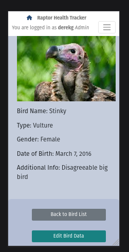
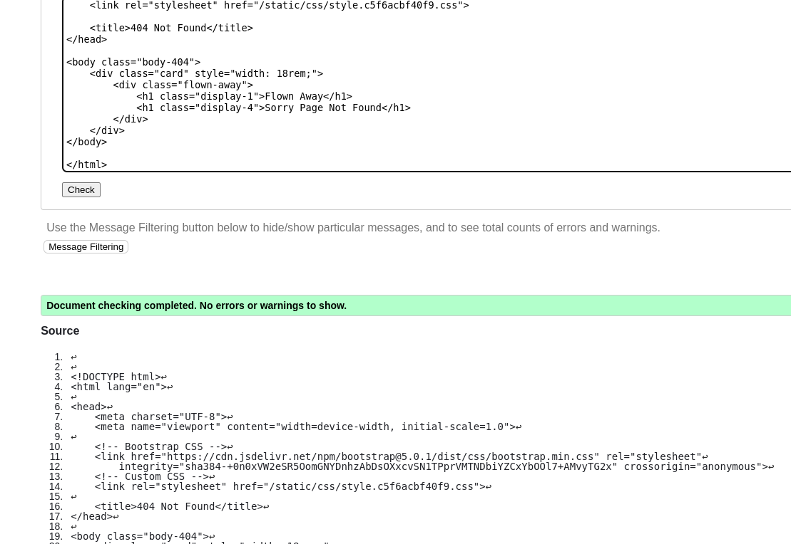

# Raptor Health Tracker

The Raptor Health Tracker is a web app designed to aid Falconers, Trainers and Rehabilitation specialists 
who work with birds of prey.
Raptors, Crows and Vultures require strict tracking of their food intake, 
their weight and exercise routines.
With the ability to upload photos and track numerous other data, 
The Raptor Health Tracker is here to help to keep the data coherent. 

## Live Site
https://raptor-health-tracker-670ca7ff3a4d.herokuapp.com/

## Repository
https://github.com/Drekkg/Raptor_Health_Tracker.git

## Author
Derek Garnett

# UX
## Target Audience
People who work with birds are well aware of how sensitive they are. Small problems can escalate really quickly.
Having the data on hand, on-line and easy to read helps make informed decisions.
Birds in breeding programs and rehabilitation centers need constant observation and tracking of various metrics:
- The bird's weight - it is crucial to notice any fluctuation in weight, especially a decrease. Measurements are taken daily, sometimes twice or more.
- Food intake - relative to weight the bird needs sufficient nourishment.
- Excercise - for their psychological well being, birds needs sufficient free flight and other stimulating activities.
The Raptor Health Tracker is here to digitalise the tracking process. Paper forms can be lost or become unreadable - birds of prey have sharp beaks and talons and enjoy shredding(and pooping on) unattended folders.
Also the ability for interested parties - vets, specialists etc, to remotely track the birds online.

## Design Choices
### Colors

The colour palette is from coolors.co
Lots of blue in different shades to evoke empty skies. Who doesn't want to be a bird - at least sometimes.
Natural greens to fit the conservation theme.

### Typography
I chose a basic font for readability.
- Roboto
- Lato 
From google
### Frameworks, plugins, tools used
- Bootstrap
- Django
- req.txt:
 -- asgiref==3.8.1
 -- cloudinary==1.36.0
 -- crispy-bootstrap5==0.7
 -- dj-database-url==0.5.0
 -- dj3-cloudinary-storage==0.0.6
 -- Django==4.2.14
 -- django-allauth==0.57.2
 -- django-crispy-forms==2.3
 -- gunicorn==20.1.0
 -- oauthlib==3.2.2
 -- psycopg2==2.9.9
 -- PyJWT==2.9.0
 -- python3-openid==3.2.0
 -- requests-oauthlib==2.0.0
 -- sqlparse==0.5.1
 -- urllib3==1.26.19
 -- whitenoise==5.3.0

## Wireframes
Landing - Login page:

Bird List Page:

 Bird detail page:

Back to bird list button - 
Edit Bird Button - 
Delete Bird Button

Add bird daily data form

Daily data accordion displaying essential data

# Information Architecture
## Entity Relationship Diagram

## Database Choice
- postgres relational database 
- heroku servers
- Cloudinary
# Data Models
- Users can add daily data
- Users can also register and start adding data. In production users would have to be vetoed by an admin to prohibit malicous or incompetent users adding data, but in lieu of this project I gave users the ability to create data.
- Logged in Admin can add birds, delete birds, delete bird daily data and edit bird data. 

## Bird Daily Data
The bird daily data view/page is the main feature of the app. Users can quickly scan and check the selected bird's weight. Clicking on the accordion will reveal all daily bird data. The user can also effortlessly add daily data.
### CRUD
- **Create:** Registered users can add daily data
- **Read:** Logged in users can read all entered data.
- **Update:** Only Administrators/super-users can edit data. 
- **Delete:** Only Administrators/super-users can delete data. 

## Breakdown of the Models
The various imports on which the models rely

### The Bird model

Custom models:
### All custom models use form validation- either max_length of string; unique entry(where appropriate); null entry not allowed.
### The cloudinary entry uses validation to check if the data being uploaded is a valid image. This occurs in the appropiate view.

### The Daily Data model

### All custom models use form validation- either max_length of string; max integer input; unique entry(where appropriate); null entry not allowed.
### The cloudinary entry uses validation to check if the data being uploaded is a valid image. This occurs in the appropiate view.

# Agile Process
## Project Goals
- Users can add and read bird daily data
- Admin can edit and delete bird data
- Admin can from the Admin dashboard edit and delete users; edit and delete birds; edit and delete daily data.
 
## Initial User Stories
[GitHub Project] (https://github.com/users/Drekkg/projects/6/views/1)

I used the MOSCOW principal to help me decide what features to include and which features to add in a future iteration.\
I first got a minimal viable product and then added extra features.\
A few features on the todo list will be added in future iterations.

### specifications changed during development
Example: Changed the ability to add birds to the table from normal User to Admin

## Scope
The initial plan for the app was increasingly made more complex as desirable features were added.\
During development a lot of features had to be recalled.\
All features not added were added to future features.\
The app successfully manages to make all entered data available for review.\
Out in the field, users can add the required data on mobile devices(Tablets and phones)\
Admins and users can view and track the data from HQ
Admins can edit the data where errors have ocurred\
Admins can delete bird data\
Admins can add new bird data
# Features
## Implemented Features
## Landing Page 

- New unauthenticted users can view the landing Page.
- Defensive programming has been used to protect tampering pages without authentication
- Users can register an account
- Usernames and email addresses must be unique
- An already registered user can login 
- A superuser account has been created (admin)
- Superuser can login using the Admin Login button and is taken to the Admin dashboard
### Admin Dashboard

- The Admin Dashboard supplied by Django.
- The Admin can edit and delete all data
### Register Page

- An unregistered user can register on the site 
- Choosing a username, entering email address and creating a password
- In production, out in the wild, a new user would have to be vetoed by an administrator-\
  but for the purposes of this project I have allowed new users onto the site.   
## User Login

- A registered user can login by entereing their username and password.
- A cancel button takes the user back to the landing page.
## Bird List Page

- Once a user is logged in they are taken to the Bird List page.
- Here all birds in the table are displayed using photos and the bird name and type.
- When no photo is available, a default image is displayed  

- Users can click on the bird name and be taken to the bird detail page
### Navbar

- The Navbar is sticky and availible on pages where the user has logged in.

 
- The users name is displayed with a message informing them that they are logged in.

 
- After clicking on the Hamburger icon

- the navbar opens giving them the option to logout
- After clicking the button the user is taken to the logout page

- Here the user can logout and be taken back to the landing page.
- or click the cancel button and go back to the bird list 

## Bird Detail Page 

- The bird detail page is opened after the user clicks on a bird name in the bird list
- This is the main page where users can view the daily entered data.
![image] (assets/bird_detail_left.png)
- the bird photo is displayed once again to help avoid confusion
- The bird data is displayed

- A button to take the user back to the bird list.

- A button to display the daily data form.
- Once clicked the user is taken to the add daily data form where they can enter the required data

## Daily Data List
 
 - Below the button a list of all entered daily data is displayed 
 - An accordion component in a closed conditiion.
 - The dates of entered data is displayed as well the trainer
 - The bird weight is prominently displayed. 
 - The user can quickly scan all daily weight data and spot discrepancies.
 - Clicking on the element will open it displaying more daily data and also if uploaded an image.
 
 - Clicking on another element will close the open element

 ## Add Daily Data Form

- The add daily data form 
- The user can enter the following data:
- Weight: The weight of the bird in grams
- Food Type: The type of food(mouse, chicken etc)
- Food weight: The weight of the food 
- Weather: the weather conditions(dropdown menu)
- Training: The type of training undertaken(dropdown menu)
- Behaviour: The modd of the bird on the day(dropdown menu)
- Notable info: Any extra information
- Add an image: The user can upload an image from their device or on mobile take a photo and upload it directly.

- After clicking the submit button a modal appears asking the user to double check the entered data.

- The Add Data Modal 
-clicking the cancel button takes the user back to the form
- Clicking enter submits the form
- The entered data is displayed on the bird detail page in the daily data accordion element.

## Administrator Site
### There are a few differences when the admin is logged in.
- The message in the Navbar displays that you are logged in as an Admin

- The open Navbar displays links to:
- The Admin Dashboard
- The Add New Bird Form
- The Add New Bird  Icon is orange to draw the users attention to it.
- It is hidden in the navbar because Admins will rarely need to add new birds.

- On the Bird Detail there are extra buttons
- A button to delete the bird from the table 
- A button to edit the bird data.

- After clicking the delete button a delete bird modal is displayed.
- The Admin is asked to affirm that they  want to delete the selected bird from the table.
- Clicking Cancel takes the Admin back to the bird detail page.
- Clicking Delete permanently removes the bird data from the table.

- Clicking the edit bird button takes the Admin to the edit bird form
- Here all Bird data can be edited.
- Clicking the Save Changes button  updates the table for the selected bird.

## 404 Page Not found

- Custom 404 not found page

## Future Features
- A graph displaying the daily bird weight, in a quick to scan, visually appealing manner.
- Birds that have not exercised or been fed will display a different colour in the bird list.
- A really important feature would be the implementation of Index DB, a mobile DB for when the users in the field have no internet connection. Data is stored locally and written to the table when the user has internet connectivity again.

# Testing
## Manual Testing

https://github.com/user-attachments/assets/afdf5523-7755-4edf-933e-b6040908f92e
A video of the app being tested:
1. From the login page an Admin can log into the app.
2. A message is displayed informing the user that they have logged in.
3. Clicking on the name of a bird in the bird list takes the user to the bird detail page.
4. A photo and all the bird details are displayed.
5. The 3 buttons are also displayed.
6. The user clicks on the add daily data button and is taken to the daily data form.
7. The required information is entered into the form
8. The form is submittedd.
9. The enter data modal appears. 
10. After checking the data and clicking the enter button the user is brought back to the bird detail page.
11. The daily data added message is displayed and clicked away.
12. The daily data is displayed in the accordion element.
13. The user clicks on the back to bird list button and is taken back to the bird list.
14. The user then clicks on the add bird button 
15. The user is taken to the add bird form
16. After entering the required information and selecting a photo the form is submitted.
17. The user is taken back to the bird list and the new bird is displayed.
18. The user then clicks on the newly made bird and deletes it.
19. A message appears saying the delete was successful 
20. The user clicks it away
21. The user then logs out of the app and logs into the admin dashboard.
22. The user goes back to the site and logs out again. 

https://github.com/user-attachments/assets/d96ebfab-c12e-497c-bbf2-401267e93cf1
A video of the daily data accordion and the edit bird functionality
1. A logged in Admin clicks on and opens an accordion element.
2. Daily data that has been entered is displayed.
3. Clicking on the element again closes it displaying just the date, trainer and the bird weight in grams in bold.
4. The user/admin clicks on the edit bird buttton
5. The user is taken to the edit bird form.
6. The user adds some text to one of the fields and changes the image.
7. After saving the changes the user is brought back to the bird detail page.
8. All the relevant changes are displayed on the page.
9. The user then swops the images back.
All edit functionality works without any glitches. the daily data is displayed in a functional way, 
and is easy to access and read. 

## Defensive programming testing

In the video below I demonstrate some of the defensive programming I have implemented,
mainly with form POST requests and cloudinary safeguarding:
https://github.com/user-attachments/assets/e9c5dd40-7516-4d43-b757-f080e0e86bcb

1. The admin user opens the add new bird page.
2. The user adds the required information in the form
3. Instead of selecting an image file the user tries to upload a music file.
4. After submitting the form  a cloudinary exception is raised in the view and the user is informed that an error has occured.
5. The user selects an appropriate file which is uploaded and displayed.
6. The user opens the add daily data form.
7. The user tries to enter large strings and integer values.
8. Again the user tries to upload a music file.
9. After submisssion the user is informed of  the incorrect data.
10. The user corrects the errors and the data is added to the table.
The bird weight, food weight and air temperature integer fields need to be further defined. Another future feature. 

## Compatibility and Responsive Testing

Galaxy S10

iPhone se

i Pad5

Linux Desktop 

## Accessibility Testing
Lighthouse accessibility Score

The app scored 90 or more on all metrics for the lighthouse score.

## Validation Testing
### CSS Validation
The [Jigsaw validator](https://jigsaw.w3.org/css-validator/) was used to validate CSS.
No errors were found.

### HTML Validation
The **[W3 HTML Validator](https://validator.w3.org/)** was used to validate HTML by coping the page source as a direct input.
No errors were found.

Landing page:

Register page:

The warnings relate to preinstalled django files

Bird List:

Bird Detail page:

Add bird page:

Log out page:

404 error page:

### JavaScript Validation
The **[Jshint validator](https://jshint.com)** was used to validate the JS function.
No errors were found.

### Python Validation
**[CI's pep8 tool](https://pep8ci.herokuapp.com/)** was used to validate each .py file created.
No errors were found.

The bird model

forms.py:

app.py:

urls.py:

views.py:

# Bugs 
- POST request missing the the request.File not uploading images.
- Errors after using the bird name as the FK when deleting the bird. Duh!! Fix was to use the django supplied bird_id

## Bug of Note
- Cloudinary crashes the app after the user tries to upload a non image file. The fix was to add a try and except clause in both views that upload images.
 

## Known issues
- CSRF weirness on mobile. Loads after refresh
- Warnings in the console relating to cloudinary using http not https. To be fixed in future iterations

- The Hamburger icon is on the right of the navbar on desktop, while the options pop out on the left. Not great UX - 
will be fixed in future iteratiions. 

# Technologies Used
## Languages
- html
- css
- java script
- python
- django

## Frameworks, Libraries & Programs Used
- Balsamiq
- Coolors.co
- fontawesome
- gitpod
- github
- google fonts
- Heroku
- Cloudinary
- postgre database
- Bootstrap
- Miso 

# Deployment
## Development Deployment
- Install required python packages: pip3 install -r requirements.txt
- Create env.py
- In env.py:
- os.environ["SECRET_KEY"] = "<YOUR_VALUE>"
- os.environ["CLOUDINARY_URL"] = "<YOUR_VALUE>"
- os.environ["DATABASE_URL"] = "<YOUR_VALUE>"
- Apply Database Migrations so the database starts up python3 manage.py migrate
- Create a super user so you can add and inspect things via django admin python3 manage.py createsuperuser
- Start the server python3 manage.py runserver

# Production Deployment
- create new Heroku app

- set app name and select your region
- Through the code institute website you will have access to a postgre database.
- copy the URL and paste it into settings of Heroku. 
- To do this, click on the settings tab and click on Reveal Config Vars
- Paste in the following settings.
1. CLOUDINARY_URL - supplied by cloudinary when you signed up
2. DATABASEURL    - supllied by Code Institute
3. SECRET_KEY     - In your env.py the secret key you selected
- Click on the deploy tab.
- connect your GitHub repo. Simply paste the url in and press connect.
- Click on  deploy! (remember to watch monitor logs for any deployment issues)

# Credits
- https://stackoverflow.com/ - code solutions
- https://github.com/Code-Institute-Org/gitpod-full-template - Code Institute Template
- Juliia Konovalova my mentor.
- I think therefore I blog - was the basis of my project. 
  I borrowed a lot of code and retooled it for my own requirements.
- GitHub Co Pilot - for when things got hairy.
- Fontawesome for the fonts
- Google fonts 
- Coolors.co 

